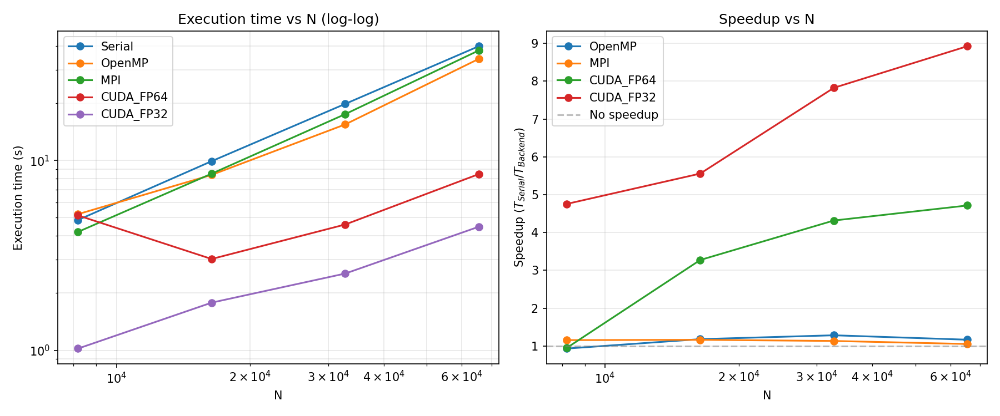
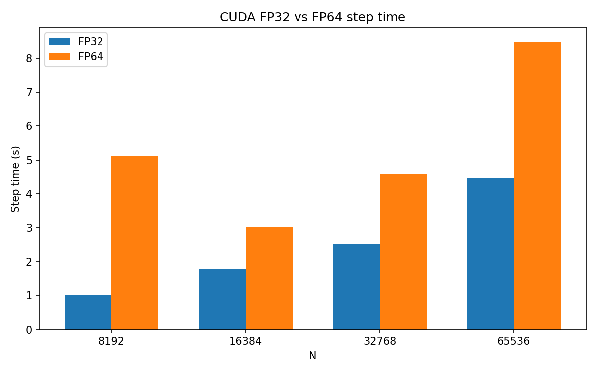
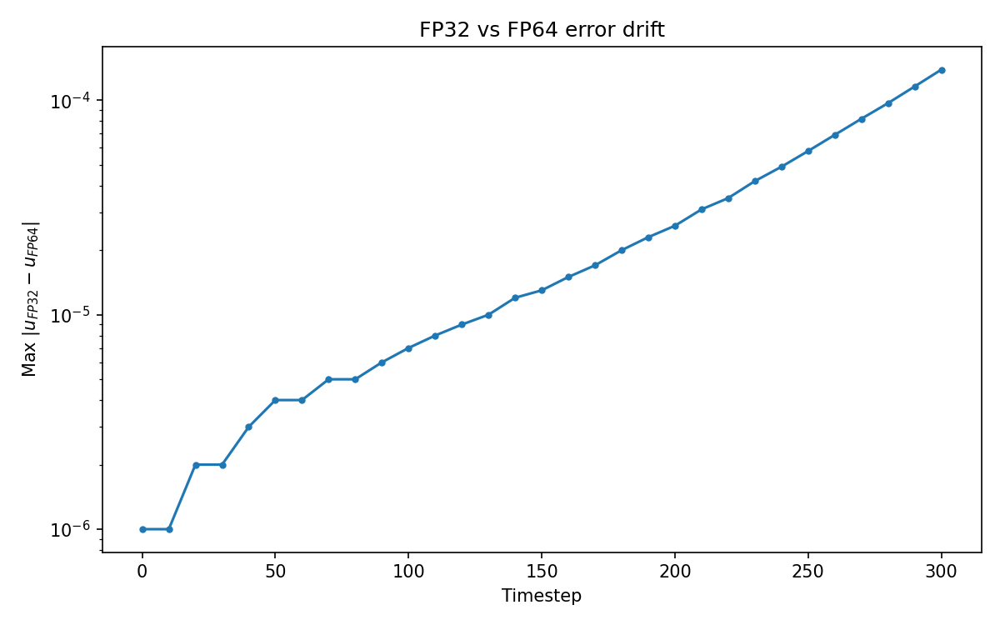
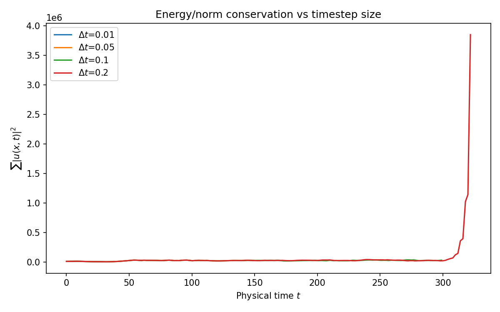
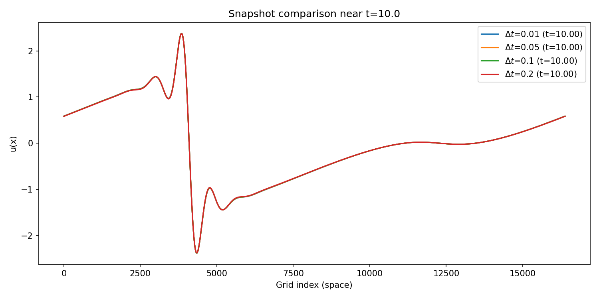
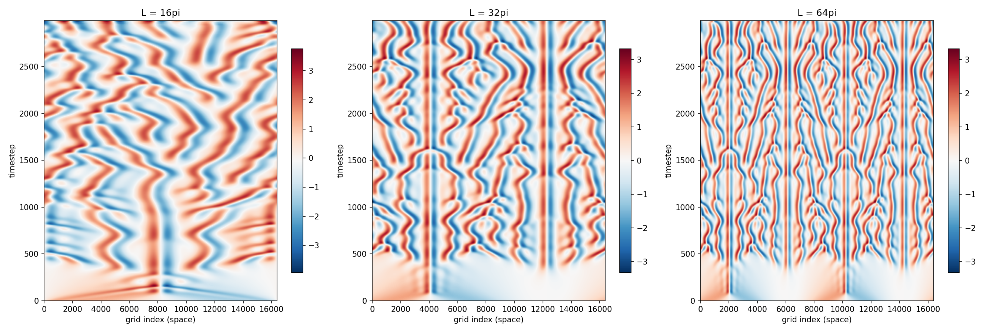
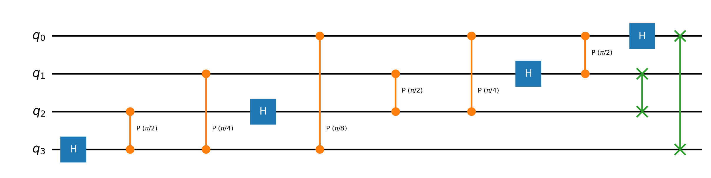
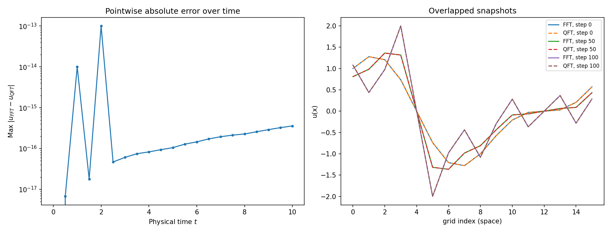

# HPC_QC_KS — A Hybrid Quantum–Classical Spectral Solver for the Kuramoto–Sivashinsky Equation

A Fourier-spectral ETDRK4 solver for the 1D Kuramoto–Sivashinsky equation (KSE), benchmarked across four classical HPC backends (Serial, OpenMP, MPI, CUDA) and extended with a small-scale hybrid module that replaces the FFT with a simulated Quantum Fourier Transform (QFT) via Qiskit.

---

## The equation

```
u_t + u u_x + u_xx + u_xxxx = 0,   u(x,t) = u(x+L,t)
```

A fourth-order nonlinear PDE that produces bounded, sustained spatiotemporal chaos — a standard low-dimensional testbed for numerical methods later aimed at harder chaotic PDEs (Navier–Stokes). The stiffness of the `u_xxxx` term is handled with ETDRK4 (Cox–Matthews / Kassam–Trefethen), which integrates the linear operator `L(k) = k² − k⁴` exactly and only approximates the nonlinear term.

---

## Repo structure

```
.
├── src/                # serial, OpenMP, MPI, CUDA (FP32/FP64), and Qiskit QFT implementations
├── Figures/            # all plots referenced in the report (see below)
├── Analysis/           # codes for regenerating analysis of the project
└── README.md
```

---

### `scaling_and_speedup.png`
Execution time (log–log) and speedup vs. `N ∈ {8192, 16384, 32768, 65536}` across all five backends.



- Runtime scales close to the theoretical `O(N log N)` FFT bound (~2.02× per doubling of N vs. a ~2.14× theoretical factor).
- OpenMP (2 threads) tops out at 1.28× and *loses* ground at N=65536 (1.17×) — a memory-bandwidth ceiling, not a launch-overhead artifact.
- 4-thread OpenMP never beats 2-thread OpenMP, and is often slower than serial — the test CPU (Intel Xeon, 2 cores/4 threads) simply doesn't have 4 physical cores to give it.
- MPI (2 ranks) tracks OpenMP at small N but falls behind at large N (1.05× at N=65536) due to the distributed FFT's communication cost.
- CUDA FP64 speedup climbs to 4.72× at N=65536 with a rising-then-flattening curve — consistent with a fixed double-precision throughput ceiling on the Tesla T4, not pure kernel-launch overhead.

### `fp32_fp64_timing.png`
CUDA step time vs. N for FP32 vs. FP64.



- FP32 is faster at *every* N tested: 5.03× at N=8192, still 1.89× at N=65536 — expected given the T4's much higher FP32 throughput.

### `fp32_fp64_error_drift_65536.png`
Pointwise trajectory drift between FP32 and FP64 runs, first 300 steps, N=65536.



- Drift stays below `1.5×10⁻⁴` over this window — ETDRK4 in FP32 is numerically safe for short-to-moderate integration, even though the underlying system is chaotic. (It would still blow up to O(1) eventually — see Lyapunov discussion below.)

### `energy_conservation.png`
`Σ|u(x,t)|²` vs. time for `Δt ∈ {0.01, 0.05, 0.1, 0.2}` at N=16384.



- Energy is bounded for `Δt ≤ 0.1`; `Δt = 0.2` blows up by ~2 orders of magnitude past `t≈300`, marking the empirical stability boundary for this configuration.
- `Δt = 0.1` was adopted as the working value throughout the rest of the report — a 10× runtime saving over `Δt = 0.01` with no loss in short-time accuracy.

### `snapshot_comparison_dt.png`
Spatial snapshots at `t≈10` across all `Δt` values, including the unstable `Δt=0.2` run.



- All snapshots agree closely at this early time, because the `Δt=0.2` instability hasn't manifested yet — a reminder that a single early-time snapshot is not sufficient to certify long-time stability.

### `domain_length_heatmaps.png`
Space–time evolution for `L ∈ {16π, 32π, 64π}`.



- `L=16π`: near-periodic (few unstable modes).
- `L=32π`: sustained irregular chaos — the validated benchmark configuration used elsewhere in the report.
- `L=64π`: roughly double the active unstable modes vs. `L=32π`, giving visibly richer, higher-dimensional chaotic structure. ETDRK4's exact linear treatment keeps the solution bounded regardless of how many unstable modes are active.

### `qft_circuit.png`
The 4-qubit QFT circuit (`N=16`) used inside the hybrid solver, generated via Qiskit, including the bit-reversal SWAPs at the end.



### `qft_fidelity.png`
Pointwise error and overlapped snapshots, classical FFT vs. QFT-based transform, at `N=16,32`.



- Agreement to `O(10⁻¹³)` at early times — the amplitude-encoding (`x/‖x‖`) and rescaling (`‖x‖√N`) correctly recover the unnormalized DFT.
- Error grows to `O(10⁻¹⁶)`–`O(10⁻¹⁵)` by `t=10` — the *same* chaotic-amplification signature seen for MPI/CUDA/FP32, just sourced from the quantum simulator's own floating-point rounding instead of a reordered classical sum.

---

## Key numbers at a glance

| Backend | Best speedup vs. serial | Bottleneck |
|---|---|---|
| OpenMP (2 threads) | 1.28× | memory bandwidth |
| MPI (2 ranks) | ~1.05× | distributed-FFT communication |
| CUDA FP64 | 4.72× | fixed FP64 throughput ceiling (T4) |
| CUDA FP32 | up to 5.03× vs. FP64 | — |
| QFT (statevector sim) | 174–187× *slower* than classical FFT | state-prep + circuit-sim overhead, not the algorithm itself |

Statevector memory for the QFT module scales **linearly** in N (only `log₂N` qubits are needed), not exponentially — extrapolating, the production size `N=16384` would need just 256 KiB of statevector memory. The real quantum bottleneck is wall-clock overhead, not memory.

---

## The unifying theme

Every source of floating-point reordering tested here — MPI's distributed FFT, CUDA's GPU reductions, FP32 vs. FP64, and the QFT's own simulator rounding — produces the *same* signature: agreement at short times, divergence at long times. This isn't a bug in any one backend; it's the KSE's positive Lyapunov exponent doing what chaotic systems do to `O(10⁻¹⁵)` differences. Validation throughout this project therefore checks **short-time trajectory agreement** (`10⁻⁶`–`10⁻⁹`) plus **bounded, qualitatively consistent long-time behavior**, rather than expecting bitwise agreement.

---

## Future work

- Koopman/Carleman-operator linearization (EDMD) of the Galerkin-truncated dynamics, for variational quantum simulation of the *full* time evolution rather than just the transform step.
- Port the hybrid pipeline to NVIDIA CUDA-Q for native single-program GPU/QPU co-execution.
- Quantify quantum error amplification under chaos using the system's Lyapunov exponent.
